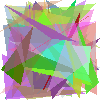
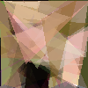
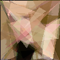
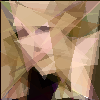

# 🧬 Genetic Algorithm – Image Approximation

A Python program that approximates a target image by evolving a population of individuals made of semi-transparent triangles. Starting from random shapes, the algorithm progressively refines each generation until it produces a faithful visual approximation of the original.

Built as a course project for **Soft Computing** at Universidad Tecnológica de Pereira.

---

## Results

### Evolution sequence

| Generation 0 | Generation 1000 | Generation 2500 | Generation 5700 |
|:---:|:---:|:---:|:---:|
|  |  |  |  |

### Target vs. final approximation

| Target | Best approximation |
|:---:|:---:|
|  |  |

---

## How It Works

Each individual in the population is a list of **70 semi-transparent triangles**, each defined by 3 normalized coordinates and an RGBA color. The algorithm renders each individual onto a 100x100 canvas and measures how close it is to the target image using **mean squared error (MSE)** as the fitness function.

Over successive generations the population evolves through:

- **Selection**: Tournament selection (size 3) picks the individuals that survive.
- **Crossover**: Pairs of individuals exchange triangles using one of three strategies chosen at random: single-point, uniform, or partial segment swap.
- **Mutation**: Each triangle has a 10% chance of being mutated per generation; the mutation randomly adjusts its color (Gaussian noise), shifts its vertices, or replaces it entirely with a new random shape.

The best individual is saved every 100 generations to `output/`.

---

## Project Structure

```
genetic-algorithm-image-approximation/
├── main.py              # Main evolutionary loop (DEAP)
├── config.py            # All hyperparameters in one place
├── core/
│   ├── individual.py    # Individual representation and random generation
│   ├── fitness.py       # Rendering with Pillow + MSE evaluation
│   ├── crossover.py     # Three crossover operators
│   └── mutation.py      # Three mutation operators
├── utils/
│   └── image.py         # Image loading and saving utilities
├── output/              
└── images/
    └── target.jpg       # Target image
```

---

## Getting Started

### Requirements

- Python 3.10+

### Install dependencies

```bash
pip install -r requirements.txt
```

### Configure

Edit `config.py` to adjust the hyperparameters before running:

```python
config = {
  "target":              "./images/target.jpg",  # Path to the target image
  "image_size":          (100, 100, 3),          # Working resolution
  "num_polygons":        70,                     # Triangles per individual
  "points_per_polygon":  3,                      # Vertices per triangle
  "population_size":     100,                    # Individuals per generation
  "mutation_prob":       0.5,                    # Probability of mutating an individual
  "crossover_prob":      0.9,                    # Probability of crossing two individuals
  "max_generations":     50000                   # Upper limit of generations
}
```

To use your own image, replace `images/target.jpg` and update the `"target"` path in `config.py`.

### Run

```bash
python main.py
```

The program prints the best fitness score each generation and saves a snapshot of the best individual every 100 generations to `output/`.

---

## Tech Stack

| | |
|---|---|
| Language | Python 3.10+ |
| Evolutionary framework | DEAP |
| Image rendering | Pillow |
| Numerical computing | NumPy |
